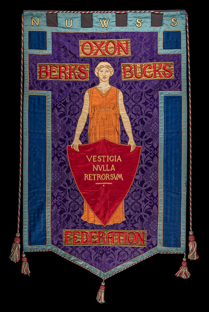
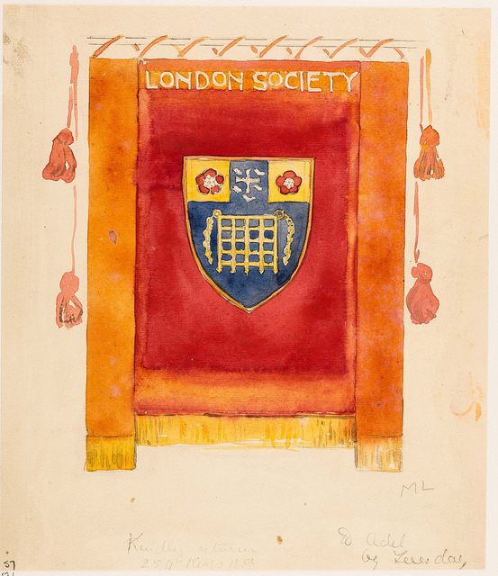
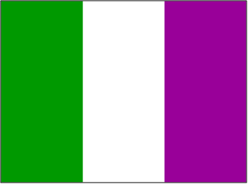

```{r, echo = FALSE}
knitr::opts_chunk$set(
  collapse = TRUE,
  comment = "#>",
  fig.path = "fig/README-",
  echo = TRUE, fig.height = 1, fig.width = 6
)
```


# 'Suffrage': a colour palette for data visualisation in R (beta)

## Installation

```{r}
# library(devtools)
# install_github("alburezg/suffrage")
```

## Usage

```{r}
library(suffrage)
```

See all available palettes:

```{r}
names(suf_palettes)
```

## Palettes

### Never a Step Backward: Oxon Berks Bucks Federation

{width=300px}

```{r}
# Discrete
suf_palette("oxon")
```

### London Society (from Mary Lowndes Album)

{width=300px}

```{r}
# Discrete
suf_palette("london")
```

### Hanwell Women's Institute

{width=300px}

```{r}
# Discrete
suf_palette("hanwell")
```

### Classic suffragette flag

{width=300px}

```{r}
# Discrete
suf_palette("flag")
```

```{r}
# Continuous
suf_palette("flag", n = 6, type = "continuous")
```

## Examples

```{r fig.width=7, fig.height=6}
library(ggplot2)
data(diamonds)

pal <- suf_palette("oxon")

ggplot(diamonds, aes(x=carat, y=price, colour=cut)) +
  geom_point() +
  scale_colour_manual(values = pal)

```
