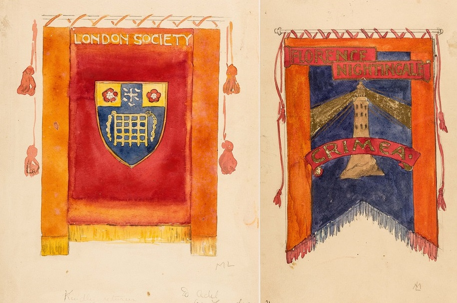
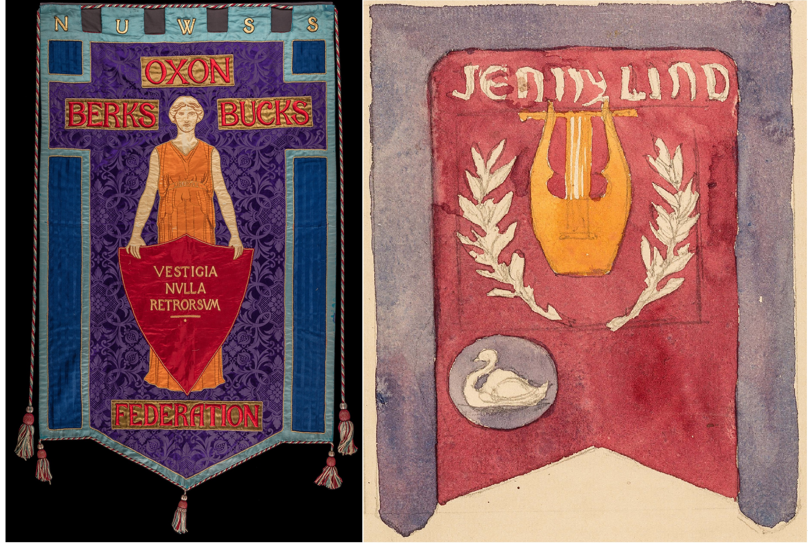
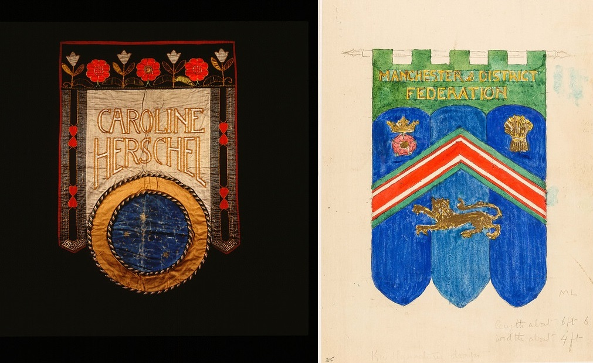
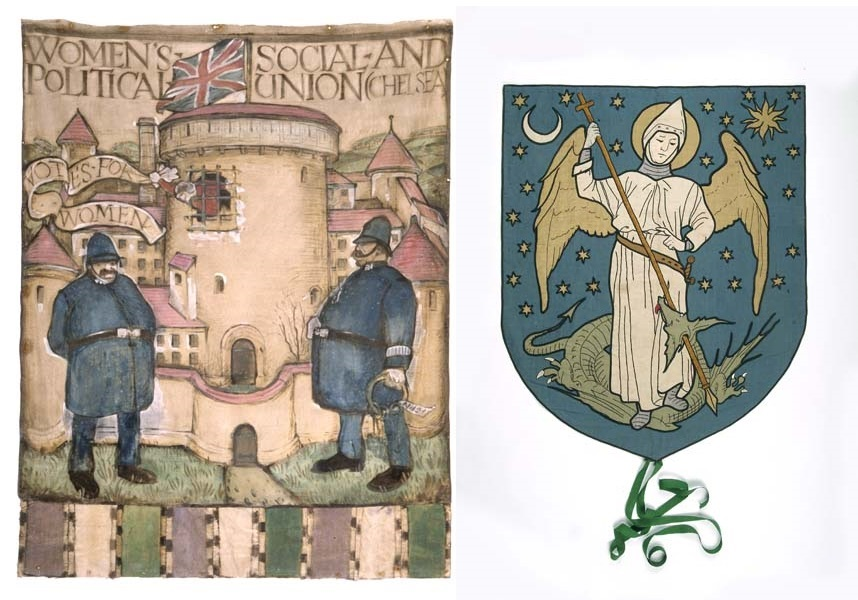
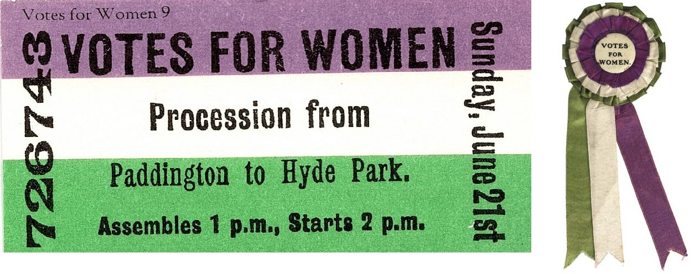

```{r, echo = FALSE}
knitr::opts_chunk$set(
  collapse = TRUE,
  comment = "#>",
  fig.path = "fig/README-",
  echo = TRUE, fig.height = 1, fig.width = 6
)
```


# 'suffrager': a feminist colour palette for R (beta)

## Installation

```{r, eval=FALSE}
library(devtools)
install_github("alburezg/suffrager")
```

## Usage

```{r}
library(suffrager)
```

See all available palettes:

```{r}
names(suf_palettes)
```

## Palettes

### 1. London Society (from Mary Lowndes Album)

{width=600px}

&nbsp;

```{r}
# Discrete
suf_palette("london")
```

### Example

```{r fig.width=7, fig.height=3}
library(ggplot2)

data(airquality)

ggplot(airquality, aes(x=Day, y=Month)) +
  geom_tile(aes(fill=Temp)) +
  scale_fill_gradientn(colours = suf_palette("london", 30, type = "continuous")) +
  coord_equal()
```

### 2. Oxon Berks Bucks Federation: Never a Step Backward

{width=600px}
&nbsp;

```{r}
# Discrete
suf_palette("oxon")
```

### Example

```{r fig.width=7, fig.height=6}
data(diamonds)

ggplot(diamonds, aes(x=carat, y=price, colour=cut)) +
  geom_point() +
  scale_colour_manual(values = suf_palette("oxon"))

```

### 3. Caroline & Manchester

{width=600px}

&nbsp;

```{r}
# Discrete
suf_palette("CarolMan")
```

### Example

```{r fig.width=7, fig.height=6}
data(iris)

ggplot(iris,aes(x = Petal.Length, fill = Species)) + 
  geom_density() +
  scale_color_manual(values = suf_palette("CarolMan"))

```

### 4. Hanwell Women's Institute

{width=600px}
&nbsp;

```{r}
# Discrete
suf_palette("hanwell")
```

### Example

```{r fig.width=7, fig.height=6}
data(diamonds)

ggplot(diamonds, aes(x = carat, fill = cut)) + 
  geom_histogram(bins = 20) +
    scale_fill_manual(values = rev(suf_palette("hanwell")))

```

### 5. Chelsea & St George

{width=600px}

```{r}
# Discrete
suf_palette("chelsea")
```

### Example

```{r fig.width=7, fig.height=6}
data("airquality")

ggplot(airquality, aes(x = factor(Month), y = Ozone, fill = factor(Month))) + 
  geom_violin() +
  scale_fill_manual(values = suf_palette("chelsea"))

```

### 6. Classic suffragette

{width=600px}

```{r}
# Discrete
suf_palette("classic")
```

```{r}
# Continuous
suf_palette("classic", n = 6, type = "continuous")
```

### Example

```{r fig.width=7, fig.height=6}
data(iris)

ggplot(iris,aes(x = Petal.Length, y = Petal.Width, color = Species)) + 
  geom_point() +
  geom_smooth(method = 'loess') +
  facet_grid(. ~ Species, scales = 'free') +
  scale_color_manual(values = suf_palette("classic", n = 3, type = "continuous"))

```


## Acknowledgements

Developed by Diego Alburez-Gutierrez and Valentina Iemmi.
The package's architecture and documentation was taken from [Karthik Ram's wesanderson package](https://github.com/karthik/wesanderson).
Images for the `london`, `oxon`, `CarolMan`, `chelsea`, and `classic` palettes used with kind permission from the [LSE Womens Library Collection](http://www.lse.ac.uk/library/collections/collection-highlights/womens-suffrage).
Images for palette `hanwell` were provided by the [100 Banners project](http://www.digitaldrama.org/100-banners-images/) and are used with the project's consent.
Want to help developd or share the word? Send a pull request or tweet @[d_alburez](https://twitter.com/d_alburez)!
