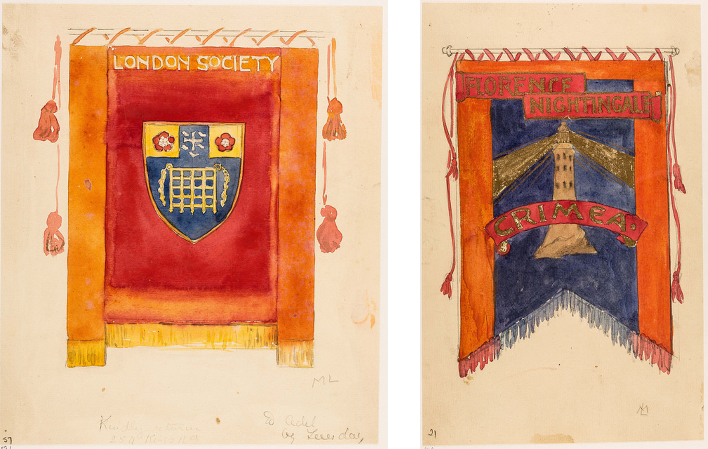
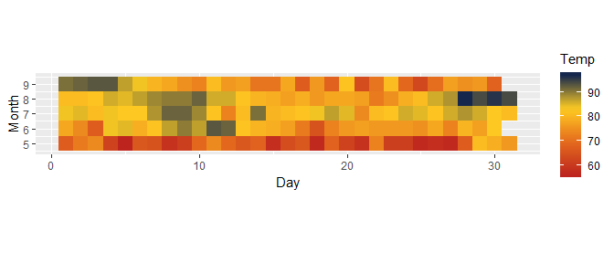
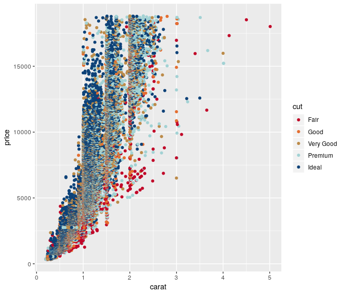
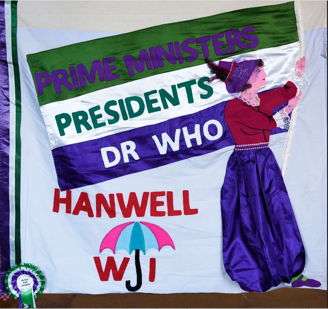
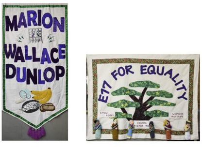
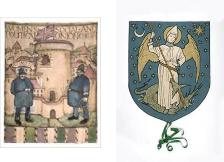
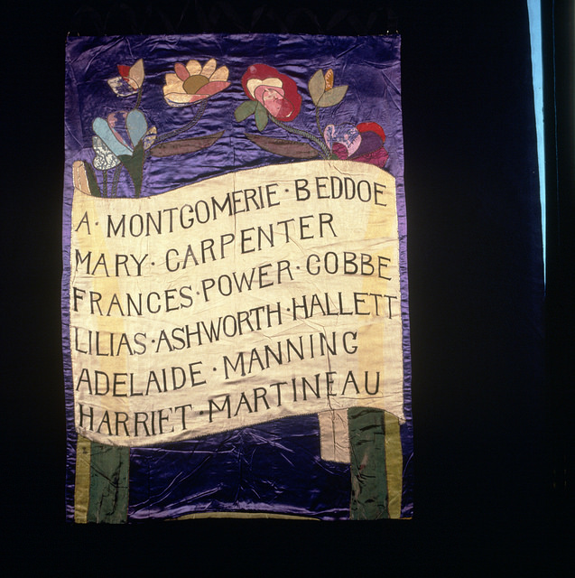
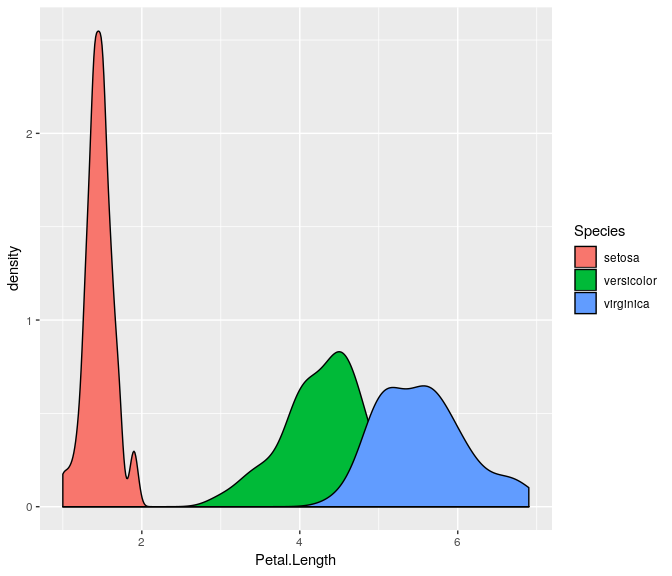

'Suffrage': a colour palette for data visualisation in R (beta)
===============================================================

Installation
------------

``` r
# library(devtools)
# install_github("alburezg/suffrage")
```

Usage
-----

``` r
library(suffrage)
```

See all available palettes:

``` r
names(suf_palettes)
#>  [1] "flag"       "london"     "hanwell"    "oxon"       "manchester"
#>  [6] "mary"       "marion"     "e17"        "equality"   "caroline"  
#> [11] "CarolMan"   "chelsea"    "StGeorge"   "chelsea2"
```

Palettes
--------

### London Society (from Mary Lowndes Album)



``` r
# Discrete
suf_palette("london")
```


### Example

``` r
library(ggplot2)
data(airquality)

ggplot(airquality, aes(x=Day, y=Month)) +
  geom_tile(aes(fill=Temp)) +
  scale_fill_gradientn(colours = suf_palette("london", 30, type = "continuous")) +
  coord_equal()
```



### Oxon Berks Bucks Federation: Never a Step Backward


``` r
# Discrete
suf_palette("oxon")
```


### Example

``` r
data(diamonds)

ggplot(diamonds, aes(x=carat, y=price, colour=cut)) +
  geom_point() +
  scale_colour_manual(values = suf_palette("oxon"))
```



### Caroline & Manchester


``` r
# Discrete
suf_palette("CarolMan")
```


### Hanwell Women's Institute



``` r
# Discrete
suf_palette("hanwell")
```


### Equality



``` r
# Discrete
suf_palette("equality")
```


### Chelsea & St George



``` r
# Discrete
suf_palette("chelsea2")
```


### Mary



``` r
# Discrete
suf_palette("mary")
```


### Classic suffragette flag


``` r
# Discrete
suf_palette("flag")
```


``` r
# Continuous
suf_palette("flag", n = 6, type = "continuous")
```



Acknowledgements
----------------

The package's architecture was taken from [Karthik Ram's wesanderson package](https://github.com/karthik/wesanderson).
